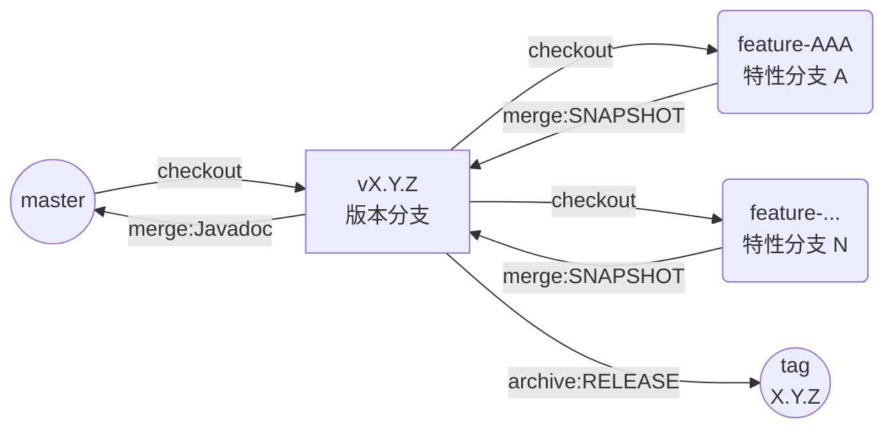
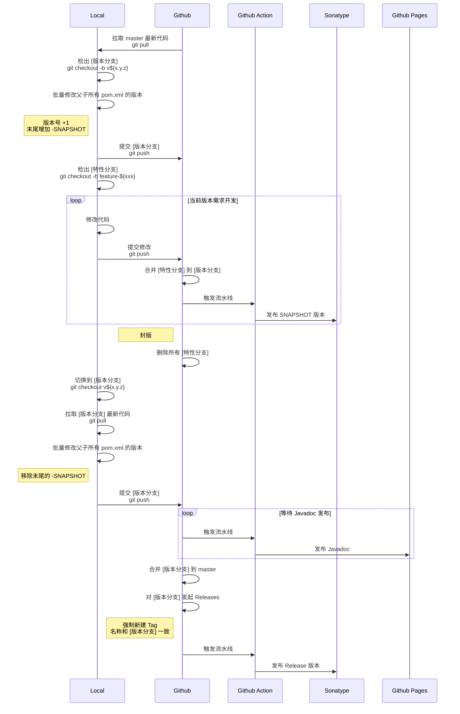

# 开发指引

------

## 发版规约

1. 拉取 master 最新代码: `git pull`
2. 从 master 检出 `[版本分支]`: `git checkout -b v${x.y.z}`
3. 批量修改父子所有 `pom.xml` 中的 `<version>`: 版本号 `+1`， 末尾增加 `-SNAPSHOT` 快照标识
4. push `[版本分支]` 到 Github
5. 从 `[版本分支]` 检出 `[特性分支]`: `git checkout -b feature-${xxx}`
6. 在 `[特性分支]` 修改代码（可以随时提交到 Github）
7. 每完成一个需求修改后，在 Github 合并 `[特性分支]` 到 `[版本分支]`，此时会触发流水线自动 deploy `SNAPSHOT` 版本到 Maven 中央仓库
8. 重复步骤 4 ~ 5， 直到当前版本的需求开发完成
9. **宣布封版**，在 Github [删除](../../branches)所有 `[特性分支]`
10. 在本地切换到 `[版本分支]`: `git checkout v${x.y.z}`
11. 拉取 `[版本分支]` 最新代码: `git pull`
12. 批量修改父子所有 `pom.xml` 中的 `<version>`: 移除末尾的 `-SNAPSHOT` 快照标识
13. 提交 `[版本分支]` 到 Github，此时会触发流水线自动生成 Javadoc
14. 等待 Javadoc 发布完成（Github Actions 会推送变更到 `[版本分支]`）
15. 在 Github 合并 `[版本分支]` 到 master
16. 在 Github 对 `[版本分支]` 发起 `Releases` 动作（会强制新建 `Tag`，名称和 `[版本分支]` 一致），此时会触发流水线自动 deploy `Release` 版本到 Maven 中央仓库
17. 重复步骤 1， 进入下一轮迭代

> 批量修改版本号，可以借助 [`bin/set_version.sh[ps1]`](bin/set_version.sh) 脚本

<b>分支示意图</b>

 

<b>发版流程示意图</b>

 

## 发布位置

在 [pom.xml](./pom.xml) 中 `<distributionManagement>` 指定版本的发布目标位置是 [sonatype nexus](https://s01.oss.sonatype.org/)。

检索关键字 `exp-blog` 可检索到本工程的[所有依赖构件](https://s01.oss.sonatype.org/#nexus-search;quick~exp-blog)：

> 用在 [sonatype jira](https://issues.sonatype.org) 注册的账号即可登录 [sonatype nexus](https://s01.oss.sonatype.org/)。

