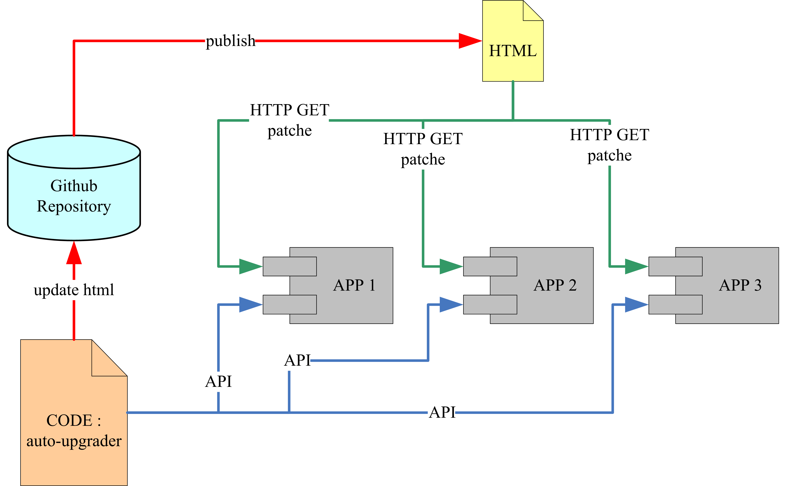

# auto-upgrader

> <b>升级补丁列表&nbsp;:&nbsp;</b>[[ Management-Page ]](https://lyy289065406.github.io/auto-upgrader/)


------

## 运行环境


 


## 插件介绍

此插件是供开发者使用的，通过它可以利用 Github 服务器发布若干个应用的升级补丁。

然后这些应用可以通过 Github 服务器提取自身的升级补丁实现在线升级。


## 实现原理




在 Github的 每个 Repository 都是可以发布一个静态页面的，而且这个静态页面可以在公网访问。

这个静态页面初衷是用来介绍 Repository 的，但是也可以利用它作为一个静态服务页，实现其他功能。


> **为某个Repository发布静态页面的方法：**
<br/>　　（1） 打开这个Repository的仓库首页
<br/>　　（2） 进入 `Settings` 页面
<br/>　　（3） 找到 `GitHub Pages`，在 `Source`下面有一个下拉框， 默认是 `None`， 修改为 `master branch`
<br/>　　（4） 然后刷新 `Settings` 页面，在 `GitHub Pages` 的位置会提示：Your site is published at `xxx-url`
<br/>　　（5） 在Repository根目录新建一个 `index.html` 文件，写入页面内容，就可以通过这个 `xxx-url` 访问它了


回到这个插件，其实原理就很简单了，要实现的功能主要有两个：

- （在开发环境）通过更新 `index.html`，在 `xxx-url` 静态页面维护若干个应用的版本信息和升级补丁
- （在生产环境）应用从 `xxx-url` 静态页面提取比当前版本更高的补丁，下载并进行升级


## 使用方式

由于插件存在两部分功能，因此使用方式也是对应拆分为两部分。


<br/>　**（开发环境）在 `xxx-url` 静态页面维护应用的版本信息和升级补丁：**

1. 通过 git 命令 clone 这个插件仓库到本地
2. 修改 `src/main/resources/exp/au/au_conf.xml` 中的版本补丁管理页面为你的 `xxx-url` 
3. 准备好某个应用在升级到下一个版本时需要用到的文件，随便放在一个目录内
4. 运行 `exp.au.PatchMaker`，通过UI读取这个目录，制作升级补丁：<br/>

5. 制作补丁的过程根据 UI 的指引去操作即可，简单来说就是告诉升级程序，应用程序在升级时，需要新增、删除、替换、移动哪些文件。点击 `一键生成补丁` 按钮后，会在 `./patches-for-page/%应用名称%/%补丁版本%` 目录下生成补丁包，同时会更新 `./index.html` 静态页面中的补丁列表。
6. 通过 git 提交变更，即成功把应用的版本信息和升级补丁提交到了 Github 服务器
7. 此时刷新静态页面地址 `xxx-url`，会发现页面内容已变更，如：


<br/>　**（生产环境）应用从 `xxx-url` 静态页面下载高版本补丁并升级：**

1. 通过 `maven install` 命令发布本插件作为 jar构件，目标应用通过 pom.xml 依赖此构件：

```xml
<dependency>
    <groupId>com.exp-blog</groupId>
    <artifactId>auto-upgrader</artifactId>
    <version>2.0.0-SNAPSHOT</version>
</dependency>
```

2. 构件内提供了 API：`exp.au.api.AppVerInfo.existNewVersion()` ，可据此检查 `xxx-url` 中是否存在新版本补丁
3. 构件内提供了 API：`exp.au.api.AppVerInfo.export()` ，让其在应用的 main 方法中执行，可在应用每次运行时导出其版本信息到 `./conf/au.ver` 文件，同时在应用根目录生成 `软件升级.exe` 用于升级
4. 运行 `软件升级.exe` 会连接到你的版本补丁管理页面 `xxx-url` ，点击 `检查更新` 按钮会与 `./conf/au.ver` 文件记录的当前版本进行比较，若存在更高版本时，点击 `一键升级` 按钮即可自动下载补丁文件并安装升级，如：<br/>

5. 另外，下载的升级补丁会保存到 `./patches` 目录，升级成功后会自动删除

